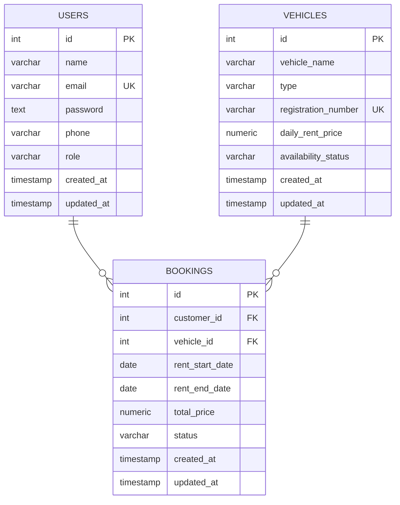

# Rentify - Vehicle Rental Booking API

A RESTful API for managing vehicle rentals with user authentication, role-based access control, and complete booking lifecycle management.

**Live URL:** [https://rentify-booking-api.vercel.app](https://rentify-booking-api.vercel.app)

---

## Features

### Authentication & Authorization

- User registration and login with JWT authentication
- Role-based access control (Admin & Customer)
- Secure password hashing with bcrypt

### Vehicle Management

- CRUD operations for vehicles (Admin only)
- Vehicle types: `car`, `bike`, `van`, `SUV`
- Availability tracking (`available` / `booked`)
- Public vehicle listing and search

### Booking System

- Create, view, and manage bookings
- Automatic price calculation based on rental duration
- Booking status management (`active`, `cancelled`, `returned`)
- Role-based booking visibility (Admin sees all, Customer sees own)

### User Management

- Admin can view all users and manage accounts
- Users can update their own profiles

---

## Technology Stack

| Category             | Technology         |
| -------------------- | ------------------ |
| **Runtime**          | Node.js            |
| **Framework**        | Express.js         |
| **Language**         | TypeScript         |
| **Database**         | PostgreSQL         |
| **Authentication**   | JWT (jsonwebtoken) |
| **Password Hashing** | bcryptjs           |
| **Logging**          | Morgan             |
| **Deployment**       | Vercel             |

---

## Project Structure

```
src/
├── config/          # Environment configuration
├── database/        # Database connection & schema
├── middleware/      # Auth & role-based access middleware
├── modules/
│   ├── auth/        # Authentication (signup/signin)
│   ├── booking/     # Booking management
│   ├── user/        # User management
│   └── vehicles/    # Vehicle CRUD operations
├── types/           # TypeScript interfaces
├── utils/           # Response helpers
├── app.ts           # Express app setup
└── server.ts        # Server entry point
```

---

## Database Schema



### Constraints

| Table      | Field                 | Allowed Values                    |
| ---------- | --------------------- | --------------------------------- |
| `vehicles` | `type`                | `car`, `bike`, `van`, `SUV`       |
| `vehicles` | `availability_status` | `available`, `booked`             |
| `bookings` | `status`              | `active`, `cancelled`, `returned` |

---

## Setup Instructions

### Prerequisites

- Node.js (v18 or higher)
- PostgreSQL database
- npm or yarn

### 1. Clone the Repository

```bash
git clone https://github.com/amisadman/rentify-booking-api.git
cd rentify-booking-api
```

### 2. Install Dependencies

```bash
npm install
```

### 3. Environment Configuration

Create a `.env` file in the root directory:

```env
PORT=5000
CONNECTION_STRING=your_connection_string
JWT_SECRET=your_super_secret_jwt_key
SALT_ROUNDS=your_salt_round
```

### 4. Run the Application

**Development Mode:**

```bash
npm run dev
```

**The server will start at:** `http://localhost:5000`

---

## API Usage

### Base URL

```
https://rentify-booking-api.vercel.app/api/v1
```

### Endpoints Overview

| Method   | Endpoint        | Description           | Auth           |
| -------- | --------------- | --------------------- | -------------- |
| `POST`   | `/auth/signup`  | Register new user     | None           |
| `POST`   | `/auth/signin`  | Login user            | None           |
| `GET`    | `/vehicles`     | Get all vehicles      | None           |
| `GET`    | `/vehicles/:id` | Get vehicle by ID     | None           |
| `POST`   | `/vehicles`     | Create vehicle        | Admin          |
| `PUT`    | `/vehicles/:id` | Update vehicle        | Admin          |
| `DELETE` | `/vehicles/:id` | Delete vehicle        | Admin          |
| `GET`    | `/users`        | Get all users         | Admin          |
| `PUT`    | `/users/:id`    | Update user           | Owner/Admin    |
| `DELETE` | `/users/:id`    | Delete user           | Admin          |
| `GET`    | `/bookings`     | Get bookings          | Customer/Admin |
| `POST`   | `/bookings`     | Create booking        | Customer/Admin |
| `PUT`    | `/bookings/:id` | Update booking status | Customer/Admin |

### Authentication Header

For protected routes, include the JWT token:

```
Authorization: Bearer <your_jwt_token>
```

---

## API Examples

### Register User

`POST` `/api/v1/auth/signup`
<br>
Content-Type: `application/json`

```bash
{
  "name": "John Doe",
  "email": "john@example.com",
  "password": "securePass123",
  "phone": "01712345678",
  "role": "customer"
}
```

### Create Vehicle (Admin)

`POST` `/api/v1/vehicles`
<br>
Authorization: `Bearer <admin_token>`
<br>
Content-Type: `application/json`

```bash
{
  "vehicle_name": "Toyota Corolla 2024",
  "type": "car",
  "registration_number": "DHK-1234",
  "daily_rent_price": 2500,
  "availability_status": "available"
}
```

### Create Booking

`POST` `/api/v1/bookings`
<br>
Authorization: `Bearer <customer_token>`
<br>
Content-Type: `application/json`

```bash
{
  "customer_id": 1,
  "vehicle_id": 1,
  "rent_start_date": "2026-01-10",
  "rent_end_date": "2026-01-13"
}
```

---

## Links

- **Live API:** [https://rentify-booking-api.vercel.app](https://rentify-booking-api.vercel.app)
- **Repository:** [https://github.com/amisadman/rentify-booking-api](https://github.com/amisadman/rentify-booking-api)
